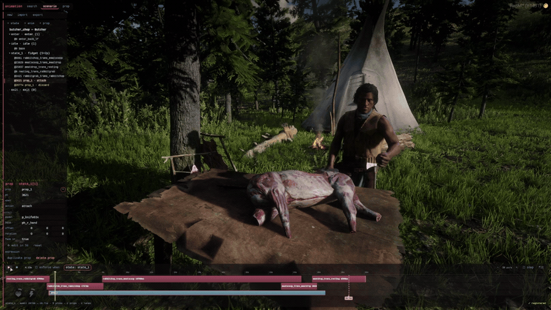
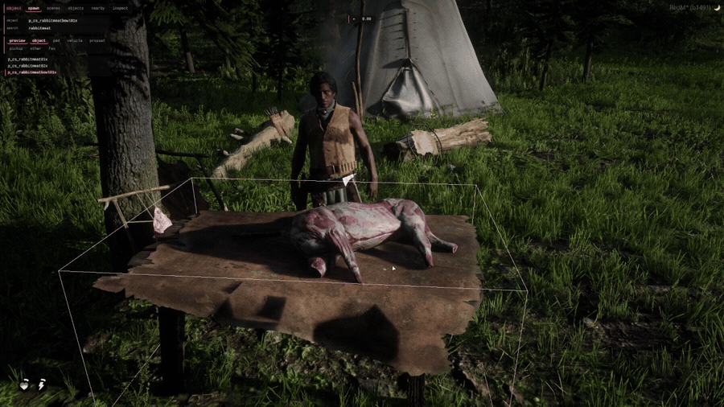

# da devkit

**In-game development tools and an animation system for RedM.** Build scenes, author
animations, and place props from inside the game — then ship what you built.


*Press **X** in game: browse context-aware scenarios and chain them together.*



*Author a scenario in game — states, prop attachment, timeline — and export the config.*



*Spawn anything, then place it with the transform gizmo.*

Free and open source. No escrow, no keymaster, no license key.

**Current release: [1.0.0](https://github.com/daggre/da-devkit/releases)** · **Help and questions: [da.dev Discord](https://discord.com/invite/JgteBpXGaA)**

---

## Two dependencies. That's it.

Every resource here needs exactly `da_log` and `da_lib`. No framework lock-in, no
database, no required inventory system. Pick the pieces you want and drop them in.

```
da_log  ──►  da_lib  ──►  everything else
```

`da_lib` includes an optional framework adapter (VORP or standalone) if you want it.

---

## What's in the kit

| Resource | Version | What it does |
|---|---|---|
| **[da_log](https://github.com/daggre/da_log)** | 1.0.0 | Level-based logging with colored output and runtime config. Tiny. Required. |
| **[da_lib](https://github.com/daggre/da_lib)** | 1.0.0 | The shared library — modes, conditions, animation, drawing, entities, input, NUI. Required. |
| **[da_dev](https://github.com/daggre/da_dev)** | 1.0.0 | The dev kit. Object editor, animation editor, freecam, placement gizmo, all through a web UI. Off by default — [dev servers only](#running-the-dev-tools). |
| **[da_anims](https://github.com/daggre/da_anims)** | 1.0.0 | Animation scenario system. Over 100 scenarios, keyboard menu, availability that reacts to what your character is doing. |
| **[da_props](https://github.com/daggre/da_props)** | 1.0.0 | Custom prop models (tipis, wikiups, ini-pi structures). Stream-only, no code. |
| **[da_game](https://github.com/daggre/da_game)** | 1.0.0 | HUD context, base game mode, world and ped density settings. |

### Not part of this release

`da_xanims` is **deprecated** — `da_anims` replaces it. Do not run both; they both bind
**X**. See the [migration notes](https://github.com/daggre/da_anims#migrating-from-da_xanims).

`da_xinteracts`, `da_audit`, `da_test`, `da_farming`, `da_tack`, `da_wardrobe`,
`da_ranching` and `da_bankrob` are either still moving or unmaintained. The repos are
public, but they are not versioned, not in the bundle, and not supported yet.

---

## Install

**Server owners — download the release zip.** No git required.

1. Grab the latest zip from [Releases](https://github.com/daggre/da-devkit/releases).
2. Unzip it into `resources/`. You get one `[da]` folder — keep the square brackets,
   they mean something to FXServer.
3. Add one line to your `server.cfg`:

   ```cfg
   exec resources/[da]/da_resources.cfg
   ```

4. Restart the server. Press **X** in game to open the animation menu.

That is the whole install. `da_resources.cfg` holds the `ensure` lines and the dev-tool
convar, so the load order is correct by default and you edit one file instead of
hunting through `server.cfg`.

Full detail in **[docs/INSTALL.md](docs/INSTALL.md)**.

**Developers** — each resource is its own repo under
[github.com/daggre](https://github.com/daggre). Clone what you need, or run
`tools/fetch-all.sh` to pull the whole set into a `[da]` folder.

---

## Running the dev tools

`da_dev` is a development kit — editors, freecam, a placement gizmo. It's for building
things, not for playing on, so it ships **off by default** and you turn it on where you
want it.

```cfg
# live server — nothing to do, 0 is the default
setr da_dev_enabled 0

# development server
setr da_dev_enabled 1
add_ace group.admin da_dev allow
```

That means one `[da]` folder deploys to both machines unchanged — no second copy, and
nothing to remember to strip out. Details, including how to grant access to specific
people, are in **[docs/DEV-TOOLS.md](docs/DEV-TOOLS.md)**.

---

## Documentation

- **[Install guide](docs/INSTALL.md)** — full setup, for server owners and developers
- **[Running the dev tools](docs/DEV-TOOLS.md)** — turning `da_dev` on, and who can use it
- **[Releasing](docs/RELEASING.md)** — versioning and release process for maintainers

Each resource has its own README. For writing animations, start with
[`da_anims/docs/CONFIG.md`](https://github.com/daggre/da_anims/blob/main/docs/CONFIG.md).

---

## Requirements

- A RedM server (FXServer, `rdr3` game build)
- Lua 5.4 — enabled per-resource, nothing to configure
- No framework required. VORP is supported if you use it.

## Support

The **[da.dev Discord](https://discord.com/invite/JgteBpXGaA)** is the fastest way to get
help — setup problems, "why isn't this in my menu", or anything the docs don't cover.

## Contributing

Bug reports and pull requests go on the individual resource repos. General questions
and "which resource should I use" belong in
[Discussions](https://github.com/daggre/da-devkit/discussions) here, or the Discord.

The animation library is built to be extended — `da_dev`'s animation editor exports a
scenario config you can drop straight into `da_anims/lib/` and submit back as a pack.

## License

| Resource | License |
|---|---|
| `da_log`, `da_lib`, `da_anims`, `da_props`, `da_game` | **MIT** |
| `da_dev` | **GPL-3.0** |
| This repo (docs and packaging) | **MIT** |

`da_dev` is GPL because it bundles
[object_gizmo](https://github.com/DemiAutomatic/object_gizmo) by DemiAutomatic
(GPL-3.0) for its transform gizmo — see
[`da_dev/NOTICE.md`](https://github.com/daggre/da_dev/blob/main/NOTICE.md).

**This does not affect the resources you ship on a server.** Copyleft flows from the
GPL code to works built on it, not backwards to its dependencies: `da_dev` depends on
`da_lib`, not the other way around. Everything in your runtime is MIT, and `da_dev` is
a development tool that stops itself in production anyway.

---

Built by **daggre_actual**.
